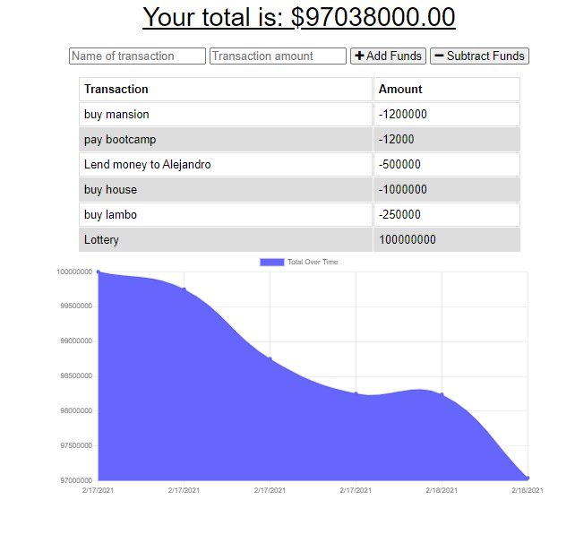

# Employee Tracker

## Task

Build a Budget Tracker application to allow for offline access and functionality.

The user will be able to add expenses and deposits to their budget with or without a connection. When entering transactions offline, they should populate the total when brought back online.

Offline Functionality:

  * Enter deposits offline

  * Enter expenses offline

When brought back online:

  * Offline entries should be added to tracker.

The application will be invoked by using the following command:

```
npm start || node app.js
```
  ## Table of Contents

  1. [User Story](#user-story)
  2. [Built With](#built-with)
  3. [How to Install](#how-to-install)
  4. [How to Use](#how-to-use)
  5. [Submission](#submission)
  6. [Example Schema](#example-schema)
  7. [Questions](#questions)

## User Story

```
AS AN avid traveller
I WANT to be able to track my withdrawals and deposits with or without a data/internet connection
SO THAT my account balance is accurate when I am traveling
```
### Built With
----
```
  * Node.js
  * Html
  * Css
  * Bootstrap
  * Chart
  * Javascript
  * Node Modules
       - "compression": "^1.7.4",
       - "express": "^4.17.1",
       - "lite-server": "^2.5.3",
       - "mongoose": "^5.5.15",
       - "morgan": "^1.9.1"
```    
### How to Install
----
```
npm i
npm run seed
```

### How to Use
----
```
  1- Go to: https://budget-trackers333.herokuapp.com/ to run the app online and go to step 6. To run the app locally go to step 2.
  2- Type "npm i" in the console to install all dependencies.
  3- Type "npm run seed" in the console to create example seeds.
  4- Type "npm start" in the console to start the app locally.
  5- Go to http://localhost:3000 in your browser.
  6- You can add a transaction with an amount and choose Add or Substract from the funds.
```    
### Submission
---

Github Repo URL: 
[https://github.com/v1zconde/budget_trackers](https://github.com/v1zconde/budget_trackers)

Heroku Deployed URL: 
[https://budget-trackers333.herokuapp.com/](https://budget-trackers333.herokuapp.com/)


### Index


---


  ## Questions
you have any questions about the repo, open an issue or contact me directly at rvasquez1@gmail.com. You can find more of my work at 
  Github: [v1zconde](http://github.com/v1zconde)

